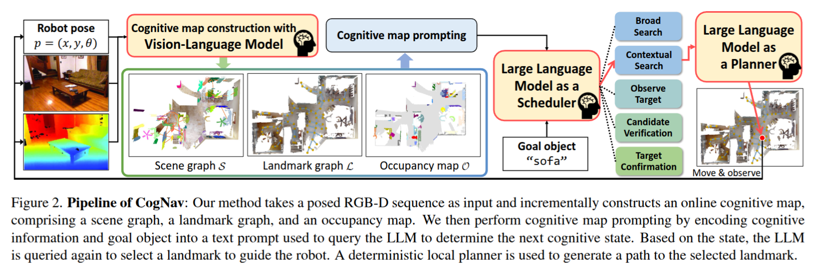

# CogNav: Cognitive Process Modeling for Object Goal Navigation with LLMs
<!-- ### [Paper](https://arxiv.org/abs/2412.10439) | [Project Page](https://yhancao.github.io/CogNav/)  -->

<!-- > Yihan Cao*, [Jiazhao Zhang](https://jzhzhang.github.io/)\*, Zhinan Yu, Shuzhen Liu, [Zheng Qin](https://scholar.google.cl/citations?user=DnHBAN0AAAAJ&hl=zh-CN/), [Qin Zou](https://scholar.google.com.hk/citations?hl=en&user=dJ8izFAAAAAJ&view_op=list_works&sortby=pubdate/), [Bo Du](https://scholar.google.com/citations?user=Shy1gnMAAAAJ&hl=zh-CN/), [Kai Xu](https://kevinkaixu.net/)$^\dagger$  
> \* Equal contribution, $\dagger$  Corresponding author -->

<!-- CogNav is an effective cognitive process modeling for ObjectNav via exploiting the commonsense and spatial reasoning capability of LLMs by online constructing a heterogeneous cognitive map representation.  
Our method is a <b>zero-shot</b> framework, that can be directly applied to different kinds of scenes and categories <b>without training</b>. -->
This is the official implementation of our ICCV 2025 paper "[CogNav: Cognitive Process Modeling for Object Goal Navigation with LLMs](https://arxiv.org/abs/2412.10439)".

## :bulb: Demo
### Scene1:


### Scene2:


You can also find more detailed demos at our [Project Page](https://yhancao.github.io/CogNav/).


## :bulb: Method Overview 

  

## :bulb: Installation

The code has been tested only with Python 3.8 on Ubuntu 22.04.

### 1. Installing Dependencies
- We use challenge-2022 versions of [habitat-sim](https://github.com/facebookresearch/habitat-sim) and [habitat-lab](https://github.com/facebookresearch/habitat-lab) as specified below:

```
git clone https://github.com/facebookresearch/habitat-sim.git
cd habitat-sim; git checkout tags/challenge-2022; 
pip install -r requirements.txt; 
python setup.py install --headless

git clone https://github.com/facebookresearch/habitat-lab.git
cd habitat-lab; git checkout tags/challenge-2022; 
pip install -e .
```

- Install [pytorch](https://pytorch.org/) according to your system configuration. The code is tested on pytorch v2.3.1 and cudatoolkit v11.8. If you are using conda:
```
conda install pytorch==2.3.1 torchvision==0.18.1 torchaudio==2.3.1 pytorch-cuda=11.8 -c pytorch -c nvidia #(Linux with GPU)
```

- Install OpenSeeD.  
Please checkout [OpenSeeD](https://github.com/facebookresearch/detectron2/) to install the dependencies.  
Download the [OpenSeeD weights](https://github.com/IDEA-Research/OpenSeeD/releases/tag/coco_pano_sota_swinl).

- Install CogVLM3
Please checkout [CogVLM2](https://github.com/THUDM/CogVLM2) to install the dependencies.  
Download the [CogVLM2 model](https://huggingface.co/THUDM/cogvlm2-llama3-chat-19B).

### 2. Download HM3D datasets:

#### Habitat Matterport
Download [HM3D](https://aihabitat.org/datasets/hm3d/) dataset using download utility and [instructions](https://github.com/facebookresearch/habitat-sim/blob/089f6a41474f5470ca10222197c23693eef3a001/datasets/HM3D.md):
```
python -m habitat_sim.utils.datasets_download --username <api-token-id> --password <api-token-secret> --uids hm3d_minival
```


## Setup
Clone the repository and install other requirements:
```
git clone https://github.com/yhanCao/CogNav_ObjNav
cd CogNav_ObjNav/
pip install -r requirements.txt
```

### Setting up datasets
The code requires the datasets in a `data` folder in the following format (same as habitat-lab):
```
CogNav_ObjNav/
  data/
    scene_datasets/
    matterport_category_mappings.tsv
    object_norm_inv_perplexity.npy
    versioned_data
    objectgoal_hm3d/
        train/
        val/
        val_mini/
```


### For evaluation: 
For evaluating the pre-trained model:
```
python3 main.py -d Results/ --skip_times 0 --scenes '5cdEh9F2hJL'
```
For batch verification:  
```
bash run.sh
```
## Citation
```
@article{cao2024cognav,
  title={CogNav: Cognitive Process Modeling for Object Goal Navigation with LLMs},
  author={Cao, Yihan and Zhang, Jiazhao and Yu, Zhinan and Liu, Shuzhen and Qin, Zheng and Zou, Qin and Du, Bo and Xu, Kai},
  journal={arXiv preprint arXiv:2412.10439},
  year={2024}
}
```
